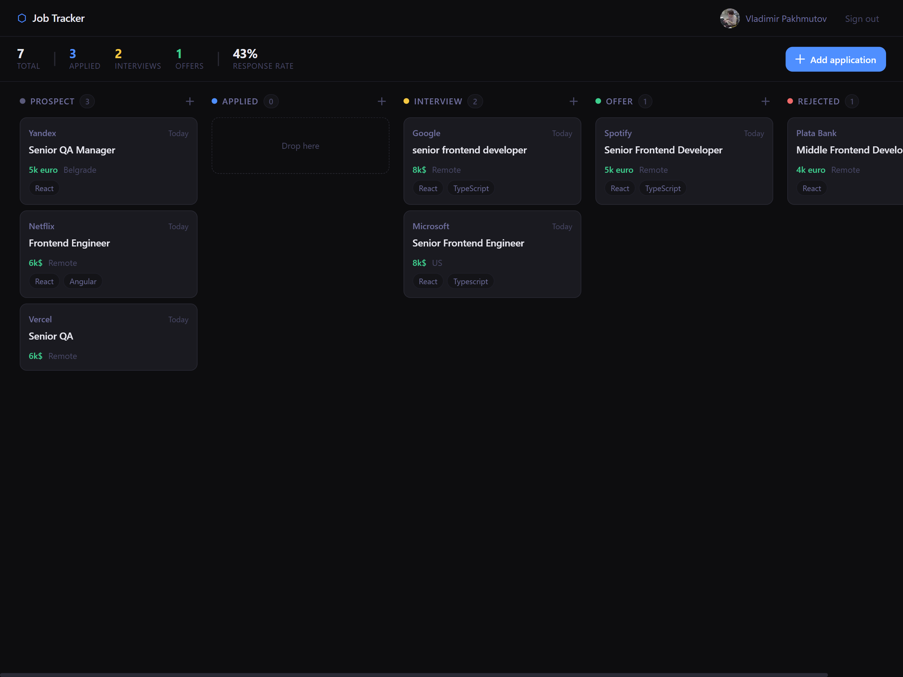

# Job Application Tracker


Kanban board for tracking job applications. Sign in with Google, add vacancies, drag them between stages, keep notes.

**[Live →](https://job-tracker-vp.vercel.app)**



---

## What it does

- Google OAuth sign-in via NextAuth v5
- Kanban board with five columns: **Prospect → Applied → Interview → Offer → Rejected**
- Cards show company favicon, salary, tags, and date added
- Drag-and-drop between columns with optimistic updates
- Slide-over panel with notes, vacancy link, and delete
- Stats strip: total / applied / interviews / offers / response rate

## Stack

| Layer         | Tech                          |
| ------------- | ----------------------------- |
| Framework     | Next.js 16 (App Router)       |
| Language      | TypeScript                    |
| Styles        | SCSS (CSS Modules)            |
| ORM           | Prisma 7 + @prisma/adapter-pg |
| Database      | PostgreSQL (Neon)             |
| Auth          | NextAuth v5 (Google OAuth)    |
| Drag-and-drop | dnd-kit                       |
| Deploy        | Vercel                        |

## Running locally

```bash
npm install
cp .env.example .env.local
# fill in the env vars
npm run dev
```

Open [http://localhost:3000](http://localhost:3000).

## Environment variables

```env
DATABASE_URL=          # PostgreSQL connection string (e.g. Neon)
AUTH_SECRET=           # random secret for NextAuth session encryption
GOOGLE_CLIENT_ID=      # Google OAuth client ID
GOOGLE_CLIENT_SECRET=  # Google OAuth client secret
```

Get a free PostgreSQL database at [neon.tech](https://neon.tech).  
Create OAuth credentials at [console.cloud.google.com](https://console.cloud.google.com).
